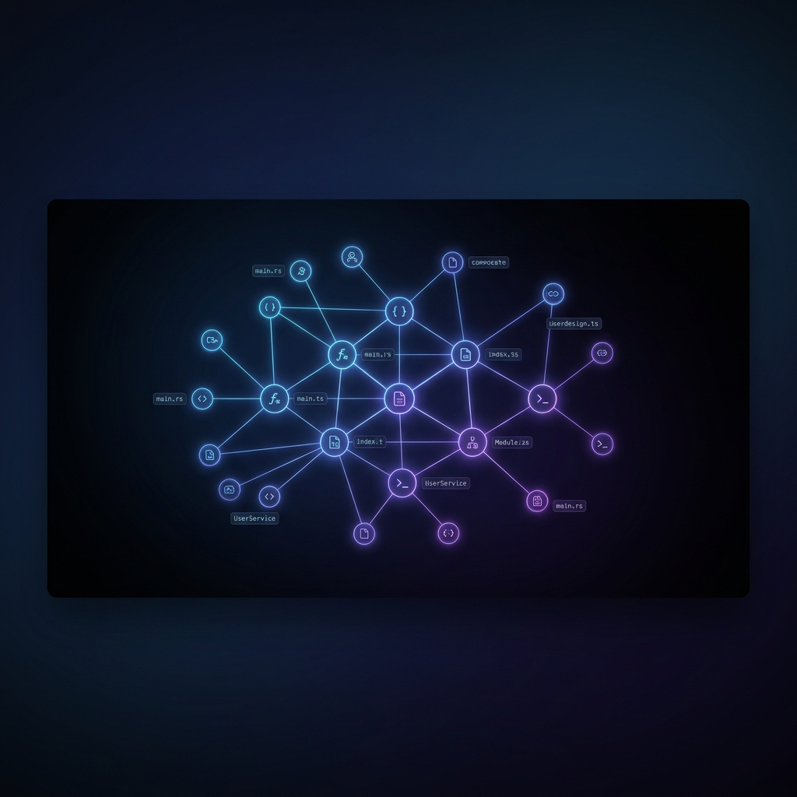
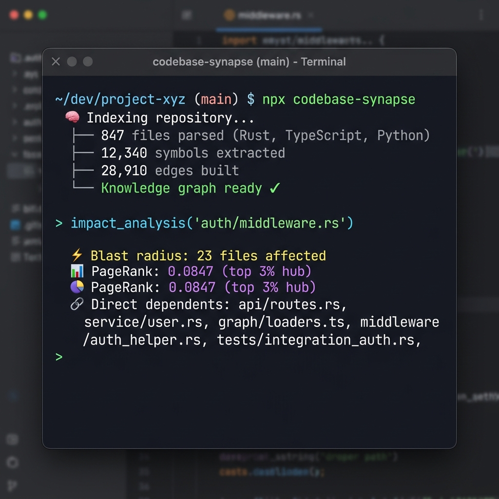

<div align="center">

# 🧠 Codebase Synapse

**Give your AI agent a deep understanding of your entire codebase.**

An MCP server that indexes your codebase into a local knowledge graph with **52 AI tools** — semantic search, call-graph traversal, git archaeology, blast-radius analysis, and more.

<br/>



<br/>

Works with **Claude Code** · **Cursor** · **Windsurf** · **Zed** · **Any MCP client**

[](https://github.com/iwiels/codebase-synapse/actions/workflows/ci.yml)
[](https://www.npmjs.com/package/codebase-synapse)
[](LICENSE)
[](https://registry.modelcontextprotocol.io)

</div>

---

## The Problem

AI coding agents (Claude, Cursor, etc.) are powerful — but they work with limited context. They can only see the files you open or feed them. Ask about call chains, architectural patterns, or blast-radius impact, and they **guess**.

**Codebase Synapse** fixes this. It indexes your entire repo into a **local knowledge graph** stored in SQLite, giving your AI agent real answers backed by structural analysis — not hallucinations.

<div align="center">

</div>

### How it works


## ⚡ Quick Start

### 1. Index your project (CLI, Zoekt-style)

```bash
codebase-synapse index /path/to/your/repo
```

Indexing runs as a separate CLI command and writes into `~/.codebase-synapse/codebase.db`. The first index is the slow one; re-running it only re-indexes changed files. The MCP server never indexes — it only reads the pre-built index.

### 2. Start the MCP server

```bash
npx codebase-synapse
```

That's it. No Docker. No database setup. No cloud. The server starts via stdio and serves the pre-built index to your MCP client.

### Configure your client

<details>
<summary><b>Claude Code / Claude Desktop</b></summary>

Add to your `claude_desktop_config.json` or `mcp_servers.json`:

```json
{
  "mcpServers": {
    "codebase-synapse": {
      "command": "npx",
      "args": ["-y", "codebase-synapse"]
    }
  }
}
```

</details>

<details>
<summary><b>Cursor</b></summary>

Add to your `.cursor/mcp.json`:

```json
{
  "mcpServers": {
    "codebase-synapse": {
      "command": "npx",
      "args": ["-y", "codebase-synapse"]
    }
  }
}
```

</details>

<details>
<summary><b>Other MCP clients</b></summary>

Any MCP client that supports **stdio** transport works. Just point it at:

```bash
npx -y codebase-synapse
```

</details>

## ✨ What It Does

### 🔍 Search & Discovery
| Tool | Description |
|:-----|:------------|
| `semantic_search` | Vector similarity search using local embeddings (all-MiniLM-L6-v2) |
| `search_code` | Full-text search across code (FTS5 + BM25 ranking) |
| `search_symbol` | Find functions, classes, types by name or pattern |
| `hybrid_search` | Combined semantic + lexical search with RRF fusion |
| `find_similar` | Find structurally similar code using MinHash + LSH |
| `find_symbol_everywhere` | Locate a symbol across all indexed projects |

### 🕸️ Knowledge Graph
| Tool | Description |
|:-----|:------------|
| `get_callers` / `get_callees` | Navigate the call graph in either direction |
| `get_imports` / `get_dependents` | Trace dependency chains |
| `impact_analysis` | Compute blast radius before editing a file |
| `find_path` | Find the shortest connection between two symbols |
| `find_dead_code` | Detect unreachable functions and unused exports |
| `get_pagerank` | Identify the most critical nodes in your architecture |
| `query_graph` | Run Cypher-like queries against the knowledge graph |

### 🏗️ Architecture
| Tool | Description |
|:-----|:------------|
| `get_architecture` | Full project architecture overview (languages, entry points, hotspots) |
| `get_file_structure` | Directory tree with symbol annotations |
| `project_overview` | High-level summary with key metrics |
| `get_route_map` | Extract HTTP routes and their handler mappings |
| `suggest_boundaries` | Detect module boundaries via Leiden clustering |
| `check_boundaries` | Validate cross-module dependencies against defined boundaries |
| `get_clusters` | Community detection across the codebase |

### 🔬 Git Archaeology
| Tool | Description |
|:-----|:------------|
| `git_archaeology` | Deep history analysis of a file (authors, churn, evolution) |
| `get_hotspots` | Files with highest complexity × change frequency |
| `detect_change_coupling` | Files that always change together |
| `get_recent_semantic_changes` | Semantically meaningful recent changes |
| `index_git_history` | Build temporal analysis from git log |

### 🧠 Memory & Context
| Tool | Description |
|:-----|:------------|
| `memory_store` / `memory_search` / `memory_list` | Persistent notes, facts, and decisions across sessions |
| `session_remember` / `session_recall` | Short-term memory within a session |
| `get_context` | Budgeted context preparation for AI agents |
| `get_edit_context` | Focused context for a specific file edit |
| `get_working_set` | Recently accessed and modified files |
| `manage_adr` | Architecture Decision Records management |

### 🛡️ Codebase Guard

Included as a bonus: **`codebase-guard`** is a `PreToolUse` hook for Claude Code that **blocks writes to high-impact files** until the agent runs `impact_analysis` first.

It uses PageRank scores and blast-radius data from the knowledge graph to identify architectural hubs. No more accidental edits to core files.

## 🔧 Technical Details

| | |
|:--|:--|
| **Language** | Rust (compiled native binary) |
| **Transport** | MCP stdio (JSON-RPC) |
| **Storage** | SQLite (WAL mode, zero config) |
| **Embeddings** | all-MiniLM-L6-v2 via Candle (offline, local, lazy-loaded) |
| **Parsing** | Tree-sitter (10 languages) |
| **Distribution** | npm with prebuilt binaries (Windows, macOS, Linux × x64, arm64) |

### Supported Languages

Rust · Python · TypeScript · JavaScript · Go · Java · C# · PHP · C · C++

### Architecture

```
src/
├── parser/       # Tree-sitter parsing & entity extraction
├── graph/        # Knowledge graph, PageRank, Leiden clustering
├── indexer/      # Repository indexing pipeline
├── search/       # BM25 full-text + vector cosine + hybrid RRF
├── embedding/    # Candle-based local embeddings (feature-gated)
├── memory/       # Persistent & session memory stores
├── mcp/          # MCP protocol transport + 52 tool handlers
├── git/          # Git archaeology, intent classification, hotspots
├── context/      # Budgeted context preparation for AI
├── cypher/       # Nom-based Cypher parser → SQL CTE planner
├── similarity/   # MinHash + LSH structural similarity
├── semantic/     # Multi-signal scoring (tokens, directory, AST)
└── cli/          # Interactive TUI installer + artifact export/import
```

## 🤝 Contributing

Contributions are welcome! The project uses standard Rust tooling:

```bash
# Run tests
cargo test

# Lint
cargo clippy -- -D warnings

# Format
cargo fmt --all
```

## 📄 License

[Apache-2.0](LICENSE)
